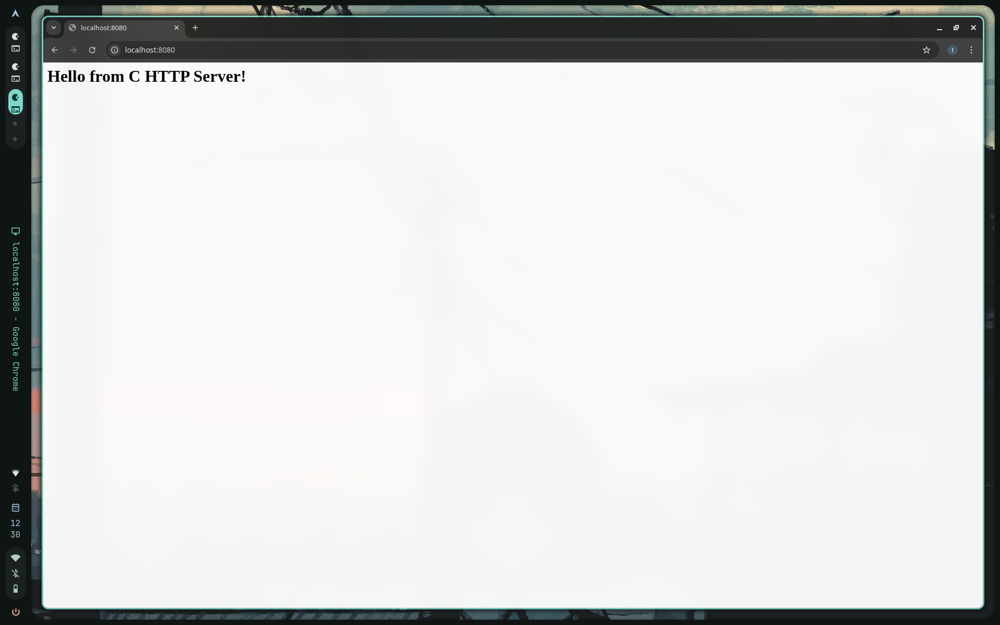
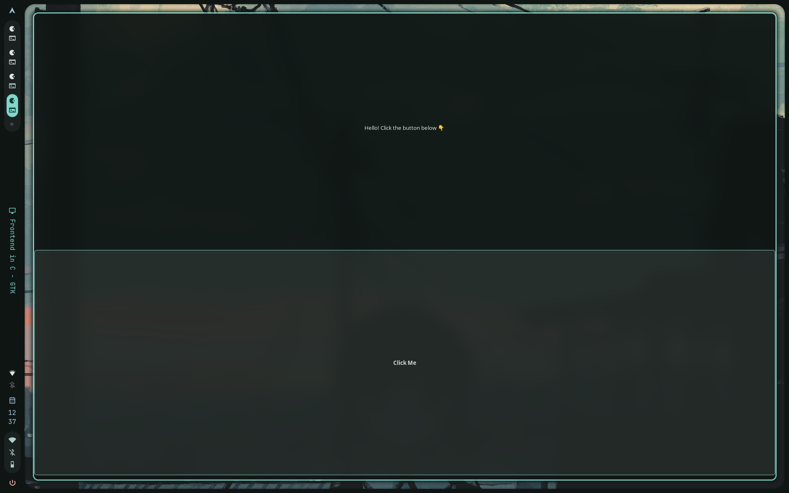
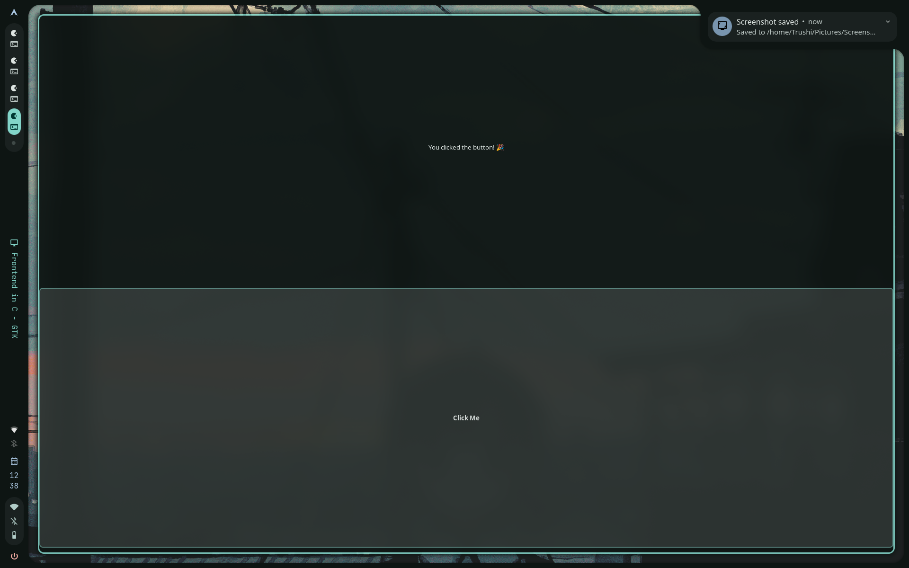
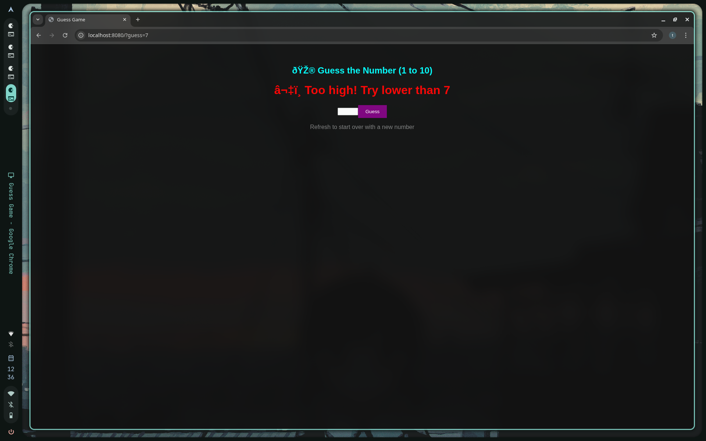
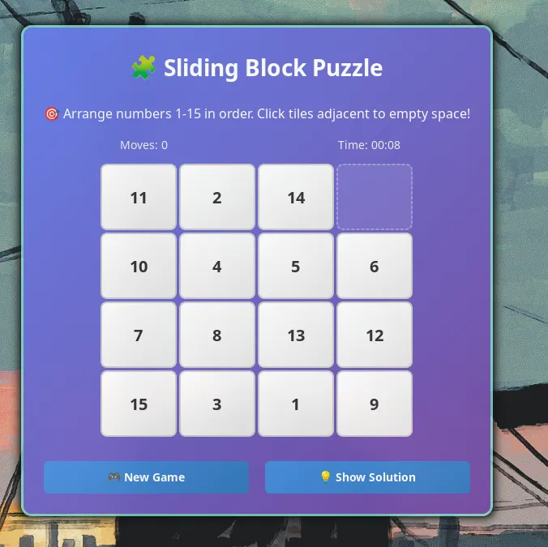

# C Projects Collection 🚀

A collection of four C projects demonstrating different aspects of systems programming, web development, and GUI development in C.

## 📋 Table of Contents

- [Projects Overview](#projects-overview)
- [Prerequisites](#prerequisites)
- [Installation](#installation)
- [Projects](#projects)
  - [1. Simple HTTP Server](#1-simple-http-server)
  - [2. GTK Frontend Demo](#2-gtk-frontend-demo)
  - [3. HTTP Guessing Game](#3-http-guessing-game)
  - [4. Sliding Block Puzzle](#4-sliding-block-puzzle)
- [Building and Running](#building-and-running)
- [Project Structure](#project-structure)
- [Contributing](#contributing)
- [License](#license)

## 🎯 Projects Overview

| Project | Technology | Description | Difficulty |
|---------|------------|-------------|------------|
| Simple HTTP Server | Socket Programming | Basic HTTP server serving static content | Beginner |
| GTK Frontend Demo | GTK3 | Simple desktop GUI application | Beginner |
| HTTP Guessing Game | Socket + HTML | Interactive web-based number guessing game | Intermediate |
| Sliding Block Puzzle | GTK3 + Game Logic | Full-featured puzzle game with timer and moves counter | Advanced |

## 🛠️ Prerequisites

### System Requirements
- GCC compiler (version 7.0 or higher)
- GNU Make
- GTK3 development libraries (for GUI projects)
- Linux/Unix environment (tested on Arch/Ubuntu/Debian)

### Arch Linux Installation
```bash
sudo pacman -S base-devel
sudo pacman -S gtk3 pkgconf
# Optional: Install development tools
sudo pacman -S gdb valgrind
```

### Ubuntu/Debian Installation
```bash
sudo apt update
sudo apt install build-essential libgtk-3-dev pkg-config
```

### Fedora/RHEL Installation
```bash
sudo dnf groupinstall "Development Tools"
sudo dnf install gtk3-devel pkg-config
```

## 📦 Installation

1. Clone or download the project files
2. Ensure all `.c` files are in the same directory
3. Install the prerequisites mentioned above

## 🎮 Projects

### 1. Simple HTTP Server
**File:** `server.c`



A minimal HTTP server that demonstrates basic socket programming concepts.

#### Features
- Serves static HTML content
- Handles basic HTTP GET requests
- Single-threaded architecture
- Lightweight and educational

#### Usage
```bash
gcc -o server server.c
./server
```
Visit: `http://localhost:8080`

#### What You'll Learn
- Socket programming basics
- HTTP protocol fundamentals
- Server-client architecture

---

### 2. GTK Frontend Demo
**File:** `main.c`




A simple desktop application showcasing GTK3 GUI development.

#### Features
- Basic GTK window with button interaction
- Event handling demonstration
- Clean, modern interface
- Cross-platform GUI

#### Usage
```bash
gcc -o gtk_demo main.c `pkg-config --cflags --libs gtk+-3.0`
./gtk_demo
```

#### What You'll Learn
- GTK3 widget system
- Event-driven programming
- GUI application structure

---

### 3. HTTP Guessing Game
**File:** `guess.c`



An interactive web-based number guessing game combining server programming with dynamic HTML generation.

#### Features
- 🎯 Random number generation (1-10)
- 🎨 Beautiful dark-themed web interface
- ⬆️⬇️ Interactive feedback (too high/too low)
- 🎉 Victory celebrations with emojis
- 🔄 Easy game restart functionality

#### Usage
```bash
gcc -o guess_game guess.c
./guess_game
```
Visit: `http://localhost:8080`

#### Game Rules
1. Server generates a random number between 1-10
2. Enter your guess in the web form
3. Receive immediate feedback
4. Keep guessing until you find the correct number!
5. Refresh page to start a new game

#### What You'll Learn
- Dynamic HTML generation in C
- HTTP form handling
- Game logic implementation
- String parsing and manipulation

---

### 4. Sliding Block Puzzle
**File:** `puzzle.c`

A fully-featured 15-puzzle game with professional GUI, timer, and game statistics.



**🎥 See it in action:**


#### Features
- 🧩 Classic 15-puzzle gameplay (4x4 grid)
- ⏱️ Real-time timer tracking
- 📊 Move counter
- 🎨 Beautiful gradient UI with modern styling
- 🎮 New Game and Show Solution buttons
- 🏆 Win detection with celebration dialog
- 💫 Smooth hover effects and animations
- 🎯 Intelligent puzzle shuffling algorithm

#### Usage
```bash
gcc -o puzzle puzzle.c `pkg-config --cflags --libs gtk+-3.0`
./puzzle
```

#### How to Play
1. **Objective:** Arrange numbers 1-15 in sequential order
2. **Movement:** Click tiles adjacent to the empty space
3. **Victory:** Complete the puzzle in the least moves and time!

#### Technical Highlights
- Advanced GTK3 styling with CSS
- Efficient puzzle shuffling algorithm
- Real-time timer updates
- Win condition detection
- Memory-safe C programming practices

#### What You'll Learn
- Advanced GTK3 development
- Game state management
- Timer implementation
- Custom CSS styling in GTK
- Algorithm design (puzzle shuffling)
- Event handling and user interaction

## 🔨 Building and Running

### Quick Start (All Projects)
```bash
# Simple HTTP Server
gcc -o server server.c && ./server

# GTK Demo
gcc -o gtk_demo main.c `pkg-config --cflags --libs gtk+-3.0` && ./gtk_demo

# Guessing Game
gcc -o guess_game guess.c && ./guess_game

# Sliding Puzzle
gcc -o puzzle puzzle.c `pkg-config --cflags --libs gtk+-3.0` && ./puzzle
```

### Makefile (Optional)
Create a `Makefile` for easier compilation:

```makefile
CC=gcc
CFLAGS=-Wall -Wextra -std=c99
GTK_FLAGS=`pkg-config --cflags --libs gtk+-3.0`

all: server gtk_demo guess_game puzzle

server: server.c
	$(CC) $(CFLAGS) -o server server.c

gtk_demo: main.c
	$(CC) $(CFLAGS) -o gtk_demo main.c $(GTK_FLAGS)

guess_game: guess.c
	$(CC) $(CFLAGS) -o guess_game guess.c

puzzle: puzzle.c
	$(CC) $(CFLAGS) -o puzzle puzzle.c $(GTK_FLAGS)

clean:
	rm -f server gtk_demo guess_game puzzle

.PHONY: all clean
```

Usage with Makefile:
```bash
make all          # Build all projects
make puzzle       # Build specific project
make clean        # Remove executables
```

## 📁 Project Structure

```
C-Projects-Collection/
├── README.md
├── server.c              # Simple HTTP server
├── main.c                # GTK frontend demo
├── guess.c               # HTTP guessing game
├── puzzle.c              # Sliding block puzzle
├── Makefile              # Optional build automation
└── screenshots/          # Project screenshots
    ├── puzzle.png        # Sliding puzzle game
    ├── guess_game.png    # HTTP guessing game
    ├── gtk_demo.png      # GTK frontend demo
    └── server.png        # Simple HTTP server
```

## 🚀 Learning Path

**Recommended order for beginners:**

1. **Start with:** Simple HTTP Server (`server.c`)
   - Learn socket programming basics
   - Understand client-server architecture

2. **Then try:** GTK Demo (`main.c`)
   - Introduction to GUI programming
   - Event-driven programming concepts

3. **Next:** HTTP Guessing Game (`guess.c`)
   - Combine web and game programming
   - Dynamic content generation

4. **Finally:** Sliding Puzzle (`puzzle.c`)
   - Advanced GUI techniques
   - Game development patterns
   - Complex state management

## 🔧 Troubleshooting

### Common Issues

**GTK3 not found:**
```bash
# Arch Linux
sudo pacman -S gtk3 pkgconf

# Ubuntu/Debian
sudo apt install libgtk-3-dev pkg-config

# Verify installation
pkg-config --modversion gtk+-3.0
```

**Port already in use:**
```bash
# Check what's using port 8080
sudo netstat -tulpn | grep 8080

# Kill process if needed
sudo killall server
sudo killall guess_game
```

**Compilation errors:**
```bash
# Ensure you have GCC installed
gcc --version

# For GTK projects, always use pkg-config
gcc puzzle.c `pkg-config --cflags --libs gtk+-3.0`
```

## 🤝 Contributing

Contributions are welcome! Here's how you can help:

1. **Bug Reports:** Found a bug? Open an issue with details
2. **Feature Requests:** Have ideas? Let's discuss them
3. **Code Improvements:** Submit pull requests with enhancements
4. **Documentation:** Help improve this README

### Development Guidelines
- Follow C99 standard
- Use consistent indentation (4 spaces)
- Add comments for complex logic
- Test on different platforms when possible
- Memory safety first - avoid leaks and segfaults

## 📝 License

This project is open source and available under the MIT License.

## 🎉 Acknowledgments

- GTK3 development team for excellent GUI framework
- C programming community for inspiration and best practices
- Socket programming tutorials that helped shape the server implementations

---

**Happy Coding! 🚀**

*Built with ❤️ using C programming language*
