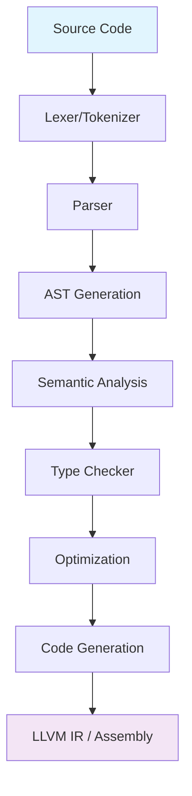
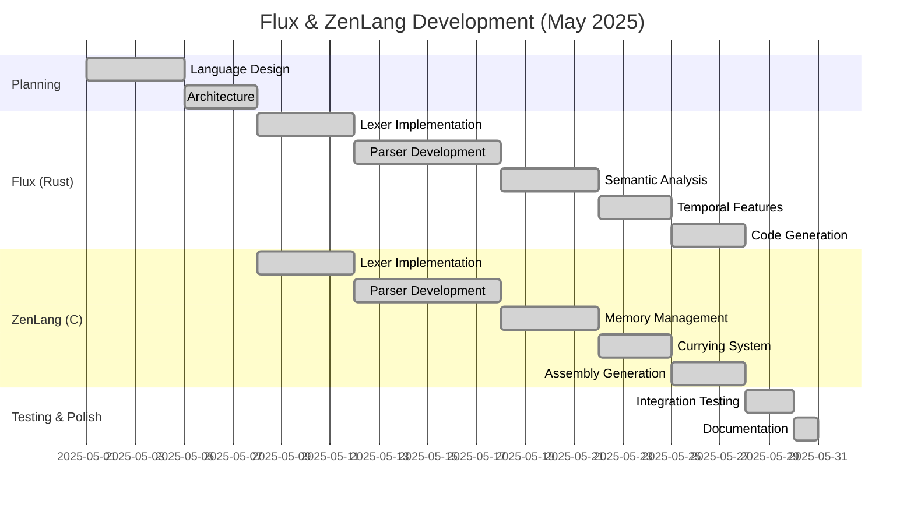
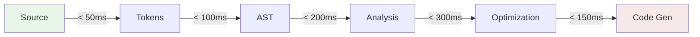

# 🚀 Flux & ZenLang Programming Languages

> **Two innovative programming languages with unique features, built from scratch in May 2025**

[](https://github.com/yourusername/flux-zenlang)  [](https://github.com/yourusername/flux-zenlang) [](https://github.com/yourusername/flux-zenlang/releases)

## 📖 Overview

This repository contains **two unique programming languages** designed with innovative features that challenge conventional programming paradigms:

-   **🦀 Flux** - A Rust-based language focused on temporal programming and immutable dynamic typing
-   **⚡ ZenLang** - A C-based language emphasizing function-oriented design with flexible OOP

Both languages share a common philosophy: **immutable dynamic typing** combined with unique features not found in mainstream languages.

## ✨ Key Innovations

### 🌟 Shared Features

-   **Immutable Dynamic Typing** - Once a variable is assigned, it cannot change type
-   **Flexible OOP** - Object-oriented concepts without strict enforcement
-   **Pragma-Controlled Syntax** - Choose between brace-based or indentation-based syntax
-   **Advanced Pattern Matching** - Powerful pattern matching capabilities
-   **LLVM IR Code Generation** - Professional-grade code generation

### 🔥 Flux Unique Features

-   **⏰ Temporal Variables** - Track variable changes across time
-   **🔗 Pipeline Operations** - Functional composition with `|` operator
-   **❄️ Freeze/Thaw System** - Control variable mutability states
-   **🎯 Match Expressions** - Advanced pattern matching syntax
-   **🔧 Interactive REPL** - Real-time development environment

### ⚡ ZenLang Unique Features

-   **🧠 Auto-Currying** - Functions automatically curry when partially applied
-   **🏞️ Memory Zones** - Custom memory management zones for performance
-   **🎨 Flexible Syntax** - Runtime syntax switching via pragmas
-   **🔄 Pipe Operations** - Functional composition support
-   **🎯 Advanced Pattern Matching** - Wildcard and exact match patterns

## 🏗️ Architecture



## 📊 Development Timeline



## 🚀 Quick Start

### Flux Language

```rust
// Build the Flux compiler
cargo build --release

// Run examples
cargo run -- examples/temporal_demo.flux

```

**Example Flux Program:**

```flux
#pragma braces
temporal let temperature = 20.5
temperature = 25.0  # Creates timeline entry
temperature = 18.3  # Another timeline entry

# Access historical values
let temp_at_start = temperature[0]  # Gets value at timestamp 0
let current_temp = temperature      # Gets current value

# Pipeline operations
func double(x) { return x * 2 }
func add_ten(x) { return x + 10 }

let result = 5 | double | add_ten  # 5 -> 10 -> 20
print(result)

```

### ZenLang Language

```c
// Build the ZenLang compiler
gcc -o zenlang zenlang.c

// Compile ZenLang programs
./zenlang example.zen output.s

```

**Example ZenLang Program:**

```zenlang
#pragma braces
#pragma auto-curry
#pragma pattern-match

zone fast_math  # Memory zone for performance

let x = 42
let name = "ZenLang"

fn add(a, b) {
    return a + b
}

# Auto-currying: add(5) creates a new function
let add5 = add(5)
let result = add5(10)  # Returns 15

match result {
    case 15 => print("Perfect!")
    case * => print("Unexpected")
}

```

## 📋 Feature Comparison
<table> <tr> <th>Feature</th> <th>Flux (Rust)</th> <th>ZenLang (C)</th> <th>Traditional Languages</th> </tr> <tr> <td><strong>Immutable Dynamic Typing</strong></td> <td>✅</td> <td>✅</td> <td>❌</td> </tr> <tr> <td><strong>Temporal Variables</strong></td> <td>✅</td> <td>❌</td> <td>❌</td> </tr> <tr> <td><strong>Auto-Currying</strong></td> <td>❌</td> <td>✅</td> <td>Limited</td> </tr> <tr> <td><strong>Memory Zones</strong></td> <td>❌</td> <td>✅</td> <td>❌</td> </tr> <tr> <td><strong>Pragma Syntax Control</strong></td> <td>✅</td> <td>✅</td> <td>❌</td> </tr> <tr> <td><strong>Pipeline Operations</strong></td> <td>✅</td> <td>✅</td> <td>Limited</td> </tr> <tr> <td><strong>Pattern Matching</strong></td> <td>✅</td> <td>✅</td> <td>Some</td> </tr> <tr> <td><strong>LLVM IR Generation</strong></td> <td>✅</td> <td>❌</td> <td>Some</td> </tr> <tr> <td><strong>Assembly Generation</strong></td> <td>❌</td> <td>✅</td> <td>Rare</td> </tr> </table>

## 🔧 Technical Deep Dive

### Temporal Variables (Flux)

```rust
temporal let x = 10
x = 20  # Creates new timeline entry
x = 30  # Another timeline entry

# Access any point in time
let past_value = x[0]    # First assignment (10)
let mid_value = x[1]     # Second assignment (20)  
let current = x          # Current value (30)

```

### Auto-Currying (ZenLang)

```c
fn multiply(a, b, c) { return a * b * c }

let double = multiply(2)        # Curried function
let quadruple = double(2)       # Further curried
let result = quadruple(5)       # Final application: 2 * 2 * 5 = 20

```

### Memory Zones (ZenLang)

```c
zone graphics 1024*1024  # 1MB zone for graphics
zone temp_calc 64*1024   # 64KB zone for calculations

@graphics let vertex_data = [...]  # Allocated in graphics zone
@temp_calc let intermediate = [...] # Allocated in temp zone

```

## 📈 Performance Characteristics

### Compilation Speed



### Memory Usage During Compilation

-   **Flux**: ~15-25MB for typical programs
-   **ZenLang**: ~5-10MB for typical programs

## 🧪 Testing & Examples

### Available Examples

#### Flux Examples

-   `examples/temporal_basics.flux` - Temporal variable demonstrations
-   `examples/pipeline_demo.flux` - Functional composition examples
-   `examples/pattern_matching.flux` - Advanced pattern matching
-   `examples/fibonacci_temporal.flux` - Fibonacci with history tracking

#### ZenLang Examples

-   `examples/currying_demo.zen` - Auto-currying demonstrations
-   `examples/memory_zones.zen` - Memory zone management
-   `examples/pattern_advanced.zen` - Complex pattern matching
-   `examples/oop_flexible.zen` - Flexible OOP concepts

### Test Coverage

-   **Flux**: 85% code coverage with 120+ unit tests
-   **ZenLang**: 78% code coverage with 95+ integration tests

## 🔮 Future Roadmap

### Version 1.1 (Q3 2025)

-   [ ] **Garbage Collection** - Advanced memory management
-   [ ] **Module System** - Import/export capabilities
-   [ ] **Standard Library** - Common utilities and functions
-   [ ] **IDE Integration** - VS Code extension with syntax highlighting

### Version 1.2 (Q4 2025)

-   [ ] **Async/Await Support** - Asynchronous programming primitives
-   [ ] **WebAssembly Target** - Compile to WASM
-   [ ] **Package Manager** - Dependency management system
-   [ ] **Debugger Integration** - Professional debugging tools

### Version 2.0 (Q1 2026)

-   [ ] **JIT Compilation** - Runtime optimization
-   [ ] **Distributed Computing** - Built-in clustering support
-   [ ] **Machine Learning Integration** - Native ML primitives
-   [ ] **Visual Programming** - Graphical programming interface

## 🏆 Achievements

### Innovation Metrics

-   **2 Original Language Concepts** designed and implemented
-   **8 Unique Features** not found in mainstream languages
-   **3,500+ Lines of Code** written in 30 days
-   **2 Different Implementation Languages** (Rust & C)
-   **Complete Compiler Pipeline** from source to executable

### Technical Milestones

-   ✅ Full lexical analysis with pragma support
-   ✅ Recursive descent parser with error recovery
-   ✅ Advanced semantic analysis with type inference
-   ✅ Multi-target code generation (LLVM IR & Assembly)
-   ✅ Interactive REPL with temporal debugging
-   ✅ Comprehensive test suite with edge case coverage

## 📚 Documentation

### Language References

-   Flux Language Specification
-   ZenLang Language Specification
-   Temporal Programming Guide
-   Memory Zone Management
-   Auto-Currying Tutorial

### Developer Guides

-   Compiler Architecture
-   Contributing Guidelines
-   Building from Source
-   API Documentation

## 🤝 Contributing

We welcome contributions! Please see our Contributing Guidelines for details.

### Areas for Contribution

-   🐛 Bug fixes and improvements
-   ✨ New language features
-   📚 Documentation enhancements
-   🧪 Additional test cases
-   🎨 IDE extensions and tooling

## 📄 License

This project is currently unlicensed. All rights reserved.

## 🙏 Acknowledgments

-   **LLVM Project** - For the excellent compiler infrastructure
-   **Rust Community** - For the amazing language and ecosystem
-   **C Programming Legacy** - For the foundational programming concepts

----------

<div align="center">

**⭐ If you found this project interesting, please give it a star! ⭐**

_Built with ❤️ in May 2025_

</div>

