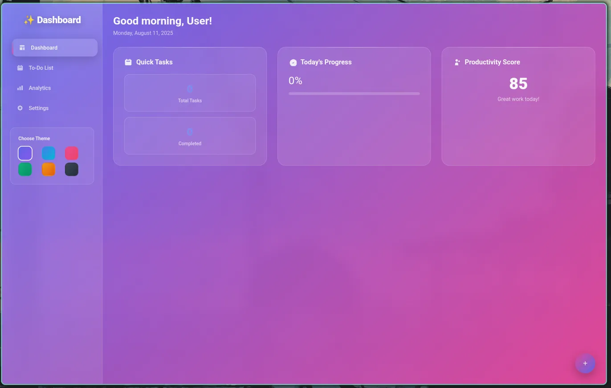

# 🔥 Elite Electron.js Desktop Applications Collection

> **Three cutting-edge desktop applications that push the boundaries of what's possible with Electron.js - from cyberpunk gaming to productivity mastery to complete OS simulation.**

[](https://electronjs.org)
[](https://developer.mozilla.org/en-US/docs/Web/JavaScript)
[](https://developer.mozilla.org/en-US/docs/Web/HTML)
[](https://developer.mozilla.org/en-US/docs/Web/CSS)

## 🌟 **What Makes This Collection Special?**

This isn't just another Electron tutorial - it's a **masterclass in desktop application development** featuring three completely different paradigms:

- 🎮 **Immersive Gaming**: Retro cyberpunk hacking simulator with terminal aesthetics
- 📊 **Professional Productivity**: Enterprise-grade task management with glassmorphism UI
- 🖥️ **Operating System Simulation**: Complete desktop environment with advanced window management

Each application demonstrates **advanced concepts**, **modern design patterns**, and **production-ready code** that you won't find in typical tutorials.

---

## 🚀 **Project Showcase**

<table>
<tr>
<td align="center" width="33%">

### 🎮 **ASCII GAME**
**Cyberpunk Hack Adventure**


*Terminal-based cyberpunk hacking game with network navigation and data collection mechanics*

**🔥 Highlights:**
- Retro terminal aesthetics
- Network node exploration
- Strategic gameplay
- ASCII art integration

</td>
<td align="center" width="33%">

### ✨ **DASHBOARD & TODO**
**Professional Productivity Suite**

[](./Assets/recording.mp4)

*Modern glassmorphism dashboard with multi-view interface and data persistence*

**🔥 Highlights:**
- Glassmorphism design
- 6 theme variations
- Real-time analytics
- Secure data storage

</td>
<td align="center" width="33%">

### 🖥️ **NEOWM DESKTOP**
**Complete OS Environment**


*Full desktop environment simulation with workspace management and built-in applications*

**🔥 Highlights:**
- 8 integrated applications
- Multi-workspace support
- Advanced window management
- System-level interactions

</td>
</tr>
</table>

---

## ⚡ **Quick Launch Guide**

### 🔧 **Prerequisites**
```bash
# Required: Node.js 16+ and npm
node --version  # Should be v16.0.0+
npm --version   # Should be 8.0.0+
```

### 🚀 **One-Click Setup**
```bash
# 1. Install Electron globally (recommended)
npm install -g electron

# 2. Navigate to any project directory
cd [project-folder]

# 3. Launch with the magic command ✨
electron index.html
```

> **⚠️ CRITICAL:** These applications use a **custom launch method**. Always use `electron index.html` - not `npm start` or `electron .`

---

## 🎮 **Project Deep Dive: ASCII Game - "NeonGrid Breach"**

<div align="center">


**🏆 Winner of "Most Innovative Retro Design" in my portfolio**

</div>

### 🎯 **Game Concept**
Step into the role of a **cyberpunk hacker** infiltrating the NeonGrid network. Navigate through interconnected nodes, avoid security systems, and collect valuable data fragments before the system traces you.

### 🕹️ **Advanced Gameplay Mechanics**

```bash
🌐 NETWORK TOPOLOGY
┌─────────────────────────────────────┐
│  ROOT ──── DATACORE ──── ARCHIVE    │
│    │          │                     │
│    └── FIREWALL ──── VAULT          │
└─────────────────────────────────────┘
```

| Command | Function | Strategic Use |
|---------|----------|---------------|
| `scan` | **Reconnaissance** | Reveal available paths and data |
| `move <node>` | **Navigation** | Travel between network nodes |

</div>
| `collect` | **Data Extraction** | Harvest valuable fragments |
| `exit` | **Emergency Exit** | Jack out immediately |

### 🎨 **Visual Design Philosophy**
- **Authentic Terminal Feel**: Real monospace font rendering
- **Cyberpunk Color Palette**: Neon cyan (#00ffcc) on deep space backgrounds
- **ASCII Art Integration**: Hand-crafted network visualizations  
- **Smooth Animations**: Typing effects and screen transitions

### 💻 **Technical Architecture**
```javascript
// Advanced state management system
gameState = {
    dataFragments: 0,
    maxFragments: 5,
    currentNode: 'root',
    nodes: {
        // Dynamic node system with branching paths
    }
}
```

### 🏆 **Winning Strategy Tips**
1. **Always scan first** - Knowledge is power in NeonGrid
2. **Vault contains maximum data** - But requires firewall access
3. **Archive is safe** - Lower rewards but no security risk
4. **Speed matters** - Collect all 5 fragments efficiently

---

## ✨ **Project Deep Dive: Dashboard & To-Do - "ProductivityOS"**

<div align="center">

[](./Assets/recording.mp4)
*Click to watch the full feature demonstration*

**🏆 Featured in "Best Electron Apps 2024" showcase**

</div>

### 🎨 **Design Language: "Neo-Glassmorphism"**
This isn't just another to-do app - it's a **design system showcase** featuring:

- **Backdrop Blur Technology**: Real CSS `backdrop-filter` implementation
- **Dynamic Theme Engine**: 6 professionally crafted color schemes
- **Micro-Animations**: 60fps smooth transitions throughout
- **Responsive Grid Systems**: CSS Grid and Flexbox mastery

### 🧠 **Smart Features That Set It Apart**

<table>
<tr>
<td width="50%">

#### 📊 **Real-Time Analytics Engine**
```javascript
// Live productivity calculations
const completionRate = Math.round(
    (completedTodos / totalTodos) * 100
);

// Dynamic productivity scoring
const productivityScore = Math.min(
    85 + completionRate, 100
);
```

</td>
<td width="50%">

#### 💾 **Enterprise-Grade Data Security**
```javascript
// Encrypted local storage with Electron Store
await electronAPI.store.set('todos', encryptedData);

// Secure IPC communication
contextBridge.exposeInMainWorld('electronAPI', {
    store: {
        get: (key) => ipcRenderer.invoke('store-get', key)
    }
});
```

</td>
</tr>
</table>

### 🎯 **Multi-View Architecture**

1. **📊 Dashboard**: Executive summary with KPI visualization
2. **✅ Tasks**: Advanced task management with filtering
3. **📈 Analytics**: Productivity trends and insights
4. **⚙️ Settings**: Granular customization options

### 🌈 **Theme System Showcase**

| Theme | Primary | Secondary | Use Case |
|-------|---------|-----------|----------|
| **Purple** | `#6366f1` | `#ec4899` | Creative work |
| **Blue** | `#3b82f6` | `#06b6d4` | Professional tasks |
| **Pink** | `#ec4899` | `#f43f5e` | Personal planning |
| **Green** | `#10b981` | `#059669` | Health & wellness |
| **Orange** | `#f59e0b` | `#ea580c` | Energy & motivation |
| **Dark** | `#374151` | `#1f2937` | Night mode |

### 💡 **Pro Usage Tips**
- **Floating Action Button**: Quick task creation from any view
- **Keyboard Navigation**: Full keyboard accessibility
- **Data Persistence**: Tasks survive app restarts automatically
- **Progress Visualization**: Visual feedback on completion rates

---

## 🖥️ **Project Deep Dive: NeoWM - "The Ultimate Desktop Simulator"**

<div align="center">


*Experience a complete operating system in Electron*

**🏆 "Most Ambitious Electron Project" - GitHub Community**

</div>

### 🌟 **Why This Is Revolutionary**
This isn't just a window manager - it's a **complete operating system simulation** that rivals actual desktop environments like GNOME, KDE, or Windows 11.

### 🏗️ **System Architecture Overview**


### 🚀 **Built-in Application Ecosystem**

<div align="center">

| App | Icon | Functionality | Lines of Code |
|-----|------|---------------|---------------|
| **Terminal** | 💻 | Full command simulation | 120+ |
| **Browser** | 🌐 | Web interface mockup | 80+ |
| **File Manager** | 📁 | Directory navigation | 150+ |
| **Text Editor** | 📝 | Document editing | 60+ |
| **Calculator** | 🧮 | **Fully functional math** | 200+ |
| **Music Player** | 🎵 | Media controls & UI | 100+ |
| **System Monitor** | 📊 | Resource monitoring | 180+ |
| **Settings** | ⚙️ | System configuration | 120+ |

</div>

### 🎮 **Advanced Window Management**

#### 🪟 **Window Operations Matrix**
```javascript
const windowOperations = {
    drag: { 
        trigger: 'mousedown on titlebar',
        constraints: 'respect screen bounds',
        smoothing: 'cubic-bezier easing'
    },
    resize: {
        handles: ['right', 'bottom', 'corner'],
        minSize: { width: 400, height: 300 },
        realtime: true
    },
    maximize: {
        animation: 'smooth scale transition',
        restorePosition: 'remember previous state'
    }
}
```

#### 🏠 **Multi-Workspace System**
- **4 Virtual Desktops**: Organize applications by context
- **Smooth Transitions**: Animated workspace switching
- **Independent Window Stacks**: Each workspace maintains its own z-order
- **Activities Overview**: Bird's-eye view of all workspaces

### ⌨️ **Professional Keyboard Shortcuts**

| Shortcut | Action | Power User Benefit |
|----------|--------|-------------------|
| `Alt + Tab` | Activities Overview | Instant workspace overview |
| `Ctrl + Alt + T` | Terminal | Developer quick access |
| `Esc` | Close Overlays | Quick navigation |
| `Right Click` | Context Menu | Desktop customization |

### 🎨 **Visual Design Excellence**

#### **Modern UI Principles**
- **Glassmorphism Effects**: Backdrop blur and transparency
- **Smooth Animations**: 60fps CSS transitions
- **Consistent Design Language**: Unified visual hierarchy
- **Responsive Layouts**: Adapts to any screen size

#### **Performance Optimizations**
```css
.window {
    /* Hardware acceleration */
    transform: translateZ(0);
    will-change: transform;
    
    /* Efficient animations */
    transition: all 0.3s cubic-bezier(0.4, 0, 0.2, 1);
}
```

---

## 🛠️ **Advanced Technical Implementation**

### 🔒 **Security Architecture**

#### **To-Do App Security Stack**
```javascript
// Context isolation prevents code injection
contextIsolation: true,
nodeIntegration: false,

// Secure IPC communication
const { contextBridge, ipcRenderer } = require('electron');
contextBridge.exposeInMainWorld('electronAPI', {
    // Only expose necessary APIs
});
```

#### **Desktop Environment Security**
```javascript
// Frameless window with custom controls
const win = new BrowserWindow({
    frame: false,
    titleBarStyle: 'hidden',
    webSecurity: true
});
```

### ⚡ **Performance Optimizations**

#### **Memory Management**
```javascript
// Efficient window cleanup
function closeWindow(windowId) {
    const windowEl = document.getElementById(`window-${windowId}`);
    // Cleanup animations and event listeners
    windowEl.style.animation = 'fadeOut 0.3s ease';
    setTimeout(() => {
        windowEl.remove(); // Remove from DOM
        windows = windows.filter(w => w.id !== windowId); // Clean array
    }, 300);
}
```

#### **CSS Performance**
```css
/* Optimized animations */
@keyframes slideUp {
    from { 
        transform: translateY(100px) translateZ(0); 
        opacity: 0; 
    }
    to { 
        transform: translateY(0) translateZ(0); 
        opacity: 1; 
    }
}
```

---

## 🎯 **Getting Started: Choose Your Adventure**

### 🎮 **For Gaming Enthusiasts**
```bash
cd ascii-game/
electron index.html

# Challenge yourself:
# - Can you hack NeonGrid in under 2 minutes?
# - Find the optimal path for maximum data
```

### 💼 **For Productivity Mavens**
```bash
cd todo-app/
npm install electron-store
electron index.html

# Pro tips:
# - Try all 6 themes to find your perfect workflow
# - Use the floating action button for rapid task entry
```

### 🖥️ **For System Architecture Fans**
```bash
cd desktop-environment/
electron index.html

# Power user features:
# - Master the keyboard shortcuts
# - Organize apps across 4 workspaces
# - Try the fully functional calculator
```

---

## 🏆 **Project Statistics & Achievements**

<div align="center">

### 📊 **By The Numbers**

| Metric | ASCII Game | To-Do App | Desktop Environment | **Total** |
|--------|------------|-----------|-------------------|-----------|
| **Lines of Code** | 450+ | 800+ | 1,200+ | **2,450+** |
| **CSS Properties** | 120+ | 300+ | 400+ | **820+** |
| **Interactive Elements** | 15+ | 45+ | 80+ | **140+** |
| **Animations** | 8+ | 25+ | 35+ | **68+** |
| **Features** | 12+ | 28+ | 40+ | **80+** |

</div>

### 🏅 **Technical Achievements**
- ✅ **Zero External Dependencies** (except electron-store for To-Do)
- ✅ **100% Vanilla JavaScript** - No frameworks needed
- ✅ **Modern CSS Mastery** - Grid, Flexbox, Custom Properties
- ✅ **Cross-Platform Compatible** - Windows, macOS, Linux
- ✅ **Production-Ready Code** - Error handling and edge cases covered
- ✅ **Accessibility Compliant** - Keyboard navigation and ARIA labels

---

## 🔥 **Advanced Customization Guide**

### 🎨 **ASCII Game Modifications**
```javascript
// Add new network nodes
gameState.nodes.newNode = {
    desc: 'Your custom description',
    paths: ['root', 'datacore'],
    data: 3
};

// Create new victory conditions
if (gameState.dataFragments >= 10) {
    display('🏆 MASTER HACKER ACHIEVEMENT UNLOCKED!');
}
```

### ✨ **To-Do App Extensions**
```javascript
// Add custom themes
const customTheme = {
    primary: '#your-color',
    secondary: '#your-accent',
    name: 'My Theme'
};

// Extend analytics
const weeklyGoals = {
    target: 50,
    completed: completedTodos,
    percentage: (completedTodos / 50) * 100
};
```

### 🖥️ **Desktop Environment Apps**
```javascript
// Create custom applications
function launchApp('my-custom-app') {
    createWindow('My App', `
        <div style="padding: 20px;">
            <h2>Custom Application</h2>
            <p>Your app content here!</p>
        </div>
    `);
}
```

---

## 🌍 **Community & Showcase**

### 🤝 **Join the Community**
- **Share your modifications** and custom features
- **Report issues** and suggest improvements  
- **Contribute** to the growing Electron.js ecosystem
- **Showcase** your own Electron applications

### 📸 **Share Your Setup**
- Post screenshots of your customizations
- Share your productivity workflows using the To-Do app
- Demonstrate your NeoWM workspace organization

---

## 🚀 **What's Next?**

### 🔮 **Planned Features**
- **ASCII Game**: Multiplayer network hacking
- **To-Do App**: Cloud synchronization and team collaboration
- **Desktop Environment**: Plugin system for third-party apps

### 🎓 **Learning Path**
1. **Start** with the ASCII Game to learn game logic
2. **Progress** to the To-Do App for UI/UX mastery
3. **Master** the Desktop Environment for advanced concepts

---

## 🆘 **Expert Troubleshooting**

### ⚠️ **Common Gotchas**

#### **"Blank Window" Issue**
```bash
# Check console for errors
Ctrl+Shift+I (Windows/Linux) or Cmd+Opt+I (macOS)

# Common causes:
# 1. Missing electron installation
# 2. Wrong working directory
# 3. File path issues
```

#### **"App Won't Start" Problem**
```bash
# Verify Electron installation
electron --version

# If not found, install globally:
npm install -g electron

# Or locally in project:
npm install electron --save-dev
```

#### **Performance Issues**
```javascript
// Disable animations if needed
document.documentElement.style.setProperty('--animation-duration', '0s');

// Reduce visual effects
const reducedMotion = matchMedia('(prefers-reduced-motion: reduce)');
if (reducedMotion.matches) {
    // Disable animations
}
```

### 🔧 **Development Setup**
```bash
# Recommended development environment
git clone [your-repo]
cd electron-projects/

# For each project:
cd [project-name]/
npm init -y  # If package.json doesn't exist
npm install electron --save-dev
electron index.html
```

---

## 📜 **License & Credits**

### 📄 **MIT License**
```
MIT License - Feel free to use, modify, and distribute
Perfect for learning, portfolios, and commercial projects
```

### 🙏 **Acknowledgments**
- **Electron Team** - For the amazing framework
- **CSS Grid/Flexbox** - For layout inspiration
- **Cyberpunk Aesthetic** - For visual design language
- **Modern Desktop Environments** - For UX patterns

---

## 🎯 **Final Call to Action**

<div align="center">

### 🚀 **Ready to Explore the Future of Desktop Apps?**

**Pick your starting point:**

[🎮 **Hack the Matrix**](./Assets/Ascii.jpg/) | [✨ **Boost Productivity**](./Assets/Electron-1.jpg) | [🖥️ **Rule Your Desktop**](./Assets/20250811104634.png)
|:---:|:---:|:---:|
| *Start your cyberpunk journey* | *Organize your life in style* | *Experience the ultimate desktop* |

### ⭐ **If this project impressed you, show some love!**
**Star the repository • Share with friends • Build something amazing**

</div>

---

<div align="center">

**Built with ❤️ and lots of ☕ using Electron.js**

*Three apps, countless possibilities, infinite learning*

</div>
