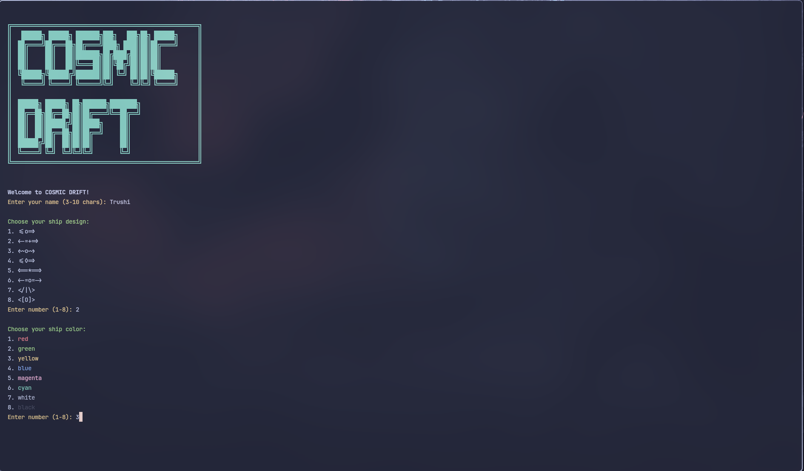
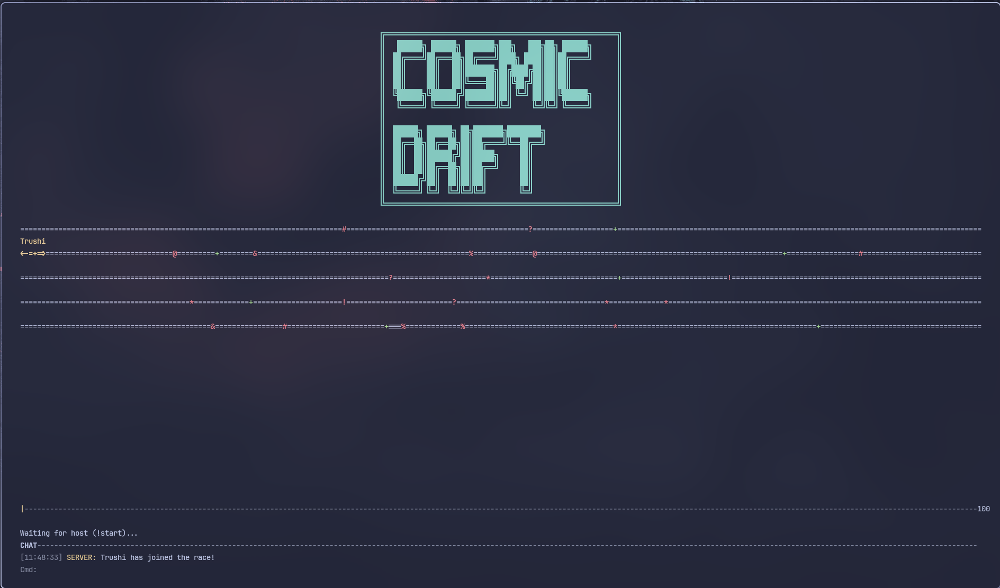
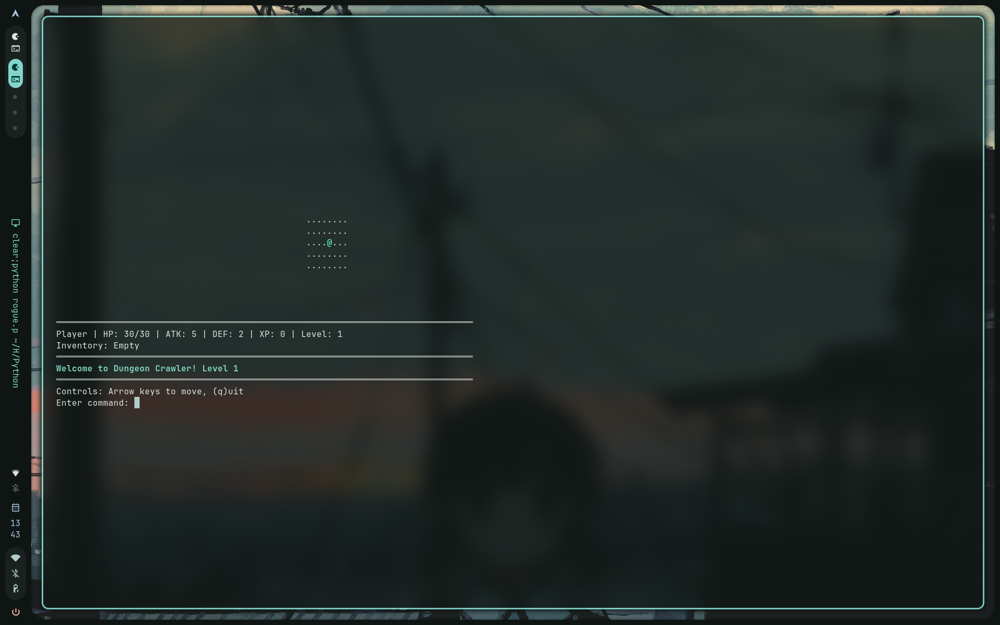

# 🎮 Terminal Games Collection
*Two Epic Adventures Await in Your Terminal*


> **Experience the golden age of gaming with modern multiplayer capabilities!** This collection brings you two masterfully crafted terminal games that prove ASCII art and command-line interfaces can deliver heart-pounding excitement.

---

## 🚀 **COSMIC DRIFT** - *Multiplayer Space Racing Mayhem*

> *"The fastest ships in the galaxy compete in the ultimate terminal racing championship!"*

### 🎬 Game Showcase

#### 🖥️ **Sleek Terminal Interface**

*The beautiful ASCII art interface with real-time race tracking, chat system, and dynamic ship positioning*

#### ⏳ **Arena Waiting Lobby**  

*Players gathering in the pre-race lobby, customizing ships and chatting before the cosmic chaos begins*

#### 🌐 **Server Hosting Made Easy**

*Simple server setup - become the race master and control the cosmic arena for up to 8 players*

#### 🔗 **Seamless Connection Experience**

*Lightning-fast connection to remote servers - join races anywhere in the galaxy*

### ✨ **Why Cosmic Drift Will Blow Your Mind**

🎯 **Real-Time Multiplayer Mayhem**
- Up to **8 players** racing simultaneously
- **Zero lag** networking with robust TCP protocol
- **Live chat** system with timestamps and colored messages
- **Instant** position updates and collision detection

🎨 **Visual Spectacle in ASCII**
- **11 unique ship designs** from sleek to battle-ready
- **8 vibrant colors** for ultimate personalization
- **Dynamic obstacles** that challenge even veteran pilots
- **Smooth animations** at 20 FPS in your terminal

⚡ **Adrenaline-Pumping Gameplay**
- **Speed boosts** for tactical advantages
- **Crash mechanics** with recovery systems
- **Real-time leaderboard** tracking
- **Procedural course generation** - no two races are the same

### 🛸 **Fleet Selection - Choose Your Cosmic Ride**

| Ship Design | Description | Best For |
|-------------|-------------|----------|
| `<=o=>` | Classic Racer | Beginners |
| `<-=+=>` | Extended Frame | Stability |
| `<~o~>` | Wave Rider | Style Points |
| `<=◊=>` | Diamond Cutter | Precision |
| `<==*==>` | Star Cruiser | Power |
| `<-=o=->` | Balanced Beast | All-around |
| `</|\>` | Arrow Speed | Velocity |
| `<[O]>` | Fortified | Defense |
| `<!--⚡>` | Lightning Bolt | Speed Demons |
| `<≈≈O≈≈>` | Hover Craft | Advanced |
| `<⚔◯⚔>` | Battle Warrior | Intimidation |

### 🎮 **Master the Controls**

```
🏁 RACING CONTROLS
├── ↑/↓ Arrow Keys → Lane switching (5 lanes available)
├── 'c' → Enter chat mode for trash talk
├── '!' → Send server commands (host powers)
├── 'q' → Quit (but why would you?)
└── 'r' → Quick restart (host only)

💬 CHAT COMMANDS
├── !start → Begin the cosmic race (host only)
├── !restart → New race, new glory (host only)
└── Regular chat → Talk smack with other racers
```

---

## 🏰 **DUNGEON CRAWLER** - *Classic Roguelike Adventure*

> *"Every step deeper reveals new horrors... and treasures beyond imagination."*

### 🎬 **Adventure Preview**

#### ⚔️ **Your Heroic Avatar**

*Meet your brave adventurer - track HP, attack, defense, XP, and inventory as you delve deeper into the mysterious dungeons*

### 🌟 **Features That Define Legends**

🗺️ **Infinite Procedural Worlds**
- **Randomly generated** dungeons every playthrough
- **Smart room placement** with connecting corridors
- **Balanced difficulty scaling** across infinite levels
- **No two adventures** are ever the same

👁️ **Immersive Field of Vision**
- **Realistic line-of-sight** with raycasting algorithms
- **Fog of war** that remembers explored areas
- **5-tile vision radius** for tactical gameplay
- **Dynamic lighting** effects in terminal

⚔️ **Strategic Combat System**
- **Turn-based tactical** combat
- **Damage calculation**: Attack vs Defense mechanics
- **Critical thinking** required for survival
- **Risk vs reward** exploration decisions

📈 **Character Progression**
- **XP-based leveling** with meaningful stat boosts
- **Weapon collection** system (Daggers, Swords, Axes)
- **Health management** with potion mechanics
- **Inventory tracking** for collected treasures

### 🗺️ **Navigate the Dungeon Realms**

```
🏃 MOVEMENT CONTROLS
├── W/A/S/D → Cardinal movement
├── Arrow Keys → Alternative movement
└── Q → Quit adventure

🌍 WORLD ELEMENTS
├── @ → You (the brave hero) 🟢
├── M → Monsters (various threats) 🔴
├── # → Impenetrable walls ⚫
├── . → Safe floor tiles ⚪
├── ! → Health potions (lifesavers) 🟣
├── / → Powerful weapons 🔵
└── > → Stairs to deeper levels 🟡
```

### 👹 **Bestiary - Know Your Enemies**

| Monster | HP | Attack | Defense | XP | Strategy |
|---------|----|---------|---------|----|----------|
| **Goblin** | 6+ | 3+ | 1 | 2 | Weak but numerous - easy pickings |
| **Orc** | 10+ | 4+ | 2 | 5 | Tough bruiser - hit and run tactics |
| **Skeleton** | 8+ | 5+ | 0 | 3 | Glass cannon - strike first! |

### ⚔️ **Weapon Arsenal**

| Weapon | Attack Bonus | Description |
|--------|--------------|-------------|
| **Dagger** | +2 | Swift and silent |
| **Sword** | +4 | Balanced and reliable |
| **Axe** | +6 | Devastating but heavy |

---

## 🚀 **Quick Start Guide**

### **Cosmic Drift Setup**

```bash
# Install requirements
pip install blessed

# Host your own racing server
python cosmic_racer.py --host

# Join the cosmic competition
python cosmic_racer.py --connect <SERVER_IP>

# Quick local race
python cosmic_racer.py

# Custom port racing
python cosmic_racer.py --host --port 6666
```

### **Dungeon Crawler Setup**

```bash
# No installation needed! Pure Python magic
python rogue.py

# That's it! Start your adventure immediately
```

---

## 🛠️ **Technical Mastery**

### **Cosmic Drift - Network Architecture**
- **Multi-threaded server** handling 8 concurrent players
- **JSON message protocol** with proper framing
- **20 FPS game loop** with client synchronization
- **Blessed terminal library** for cross-platform UI
- **Robust error handling** and graceful disconnections

### **Dungeon Crawler - Game Engine**
- **Procedural generation** using BSP-like algorithms
- **Raycasting FOV** for realistic vision
- **ANSI color system** for rich visuals
- **Object-oriented design** with clean entity management
- **Turn-based logic** with strategic depth

---

## 🎯 **Game Modes & Strategies**

### **Cosmic Drift Tactics**
- **Lane Management**: Master the 5-lane system
- **Boost Timing**: Collect power-ups strategically
- **Crash Recovery**: 3-second downtime - plan accordingly
- **Chat Warfare**: Psychological tactics in multiplayer

### **Dungeon Crawler Mastery**
- **Resource Management**: Balance health and exploration
- **Combat Positioning**: Use corridors tactically
- **Item Priority**: Weapons vs health - choose wisely
- **Level Progression**: Risk deeper levels for better rewards

---

## 🐛 **Troubleshooting & Support**

### **Common Issues & Solutions**

| Issue | Game | Solution |
|-------|------|----------|
| "blessed library not found" | Cosmic Drift | `pip install blessed` |
| Connection refused | Cosmic Drift | Check server status and firewall |
| Terminal colors missing | Both | Enable ANSI color support |
| Screen flickering | Dungeon Crawler | Try different terminal emulator |
| Input lag | Dungeon Crawler | Normal - game uses Enter key |

---


## 🤝 **Join the Community**

### **Contributing**
We welcome contributions! Here's how you can help:

- 🐛 **Bug Reports**: Found an issue? Let us know!
- ✨ **Feature Requests**: Dream up new game mechanics
- 🔧 **Code Contributions**: Submit pull requests
- 📖 **Documentation**: Help improve our guides
- 🎨 **ASCII Art**: Design new ships or dungeon elements

### **Development Roadmap**

#### **Cosmic Drift Future**
- [ ] Tournament brackets and seasons
- [ ] Replay system for epic races
- [ ] Custom track editor
- [ ] AI opponents for practice
- [ ] Global leaderboards and statistics

#### **Dungeon Crawler Evolution**
- [ ] Multiple character classes (Warrior, Mage, Rogue)
- [ ] Magic system with spells
- [ ] Save/load game functionality
- [ ] Boss battles and special levels
- [ ] Multiplayer dungeon exploration

---

## 📊 **Game Statistics**

| Metric | Cosmic Drift | Dungeon Crawler |
|--------|--------------|-----------------|
| **Max Players** | 8 simultaneous | 1 (single-player) |
| **Game Length** | 2-5 minutes | 30+ minutes |
| **Difficulty** | Medium | Hard |
| **Replayability** | ⭐⭐⭐⭐⭐ | ⭐⭐⭐⭐⭐ |
| **Network Required** | Optional | No |
| **Learning Curve** | Gentle | Steep |

---

## 📄 **License & Credits**

This project is currently unlicensed. All rights reserved.

**Built with ❤️ using:**
- Python 3.x
- Blessed library (Cosmic Drift)
- Pure terminal magic (Dungeon Crawler)
- Countless hours of playtesting

---

## 🎮 **Ready to Play?**

Clone this repository and dive into two worlds of terminal gaming excellence:

```bash
git clone https://github.com/yourusername/terminal-games.git
cd terminal-games

# Start your cosmic racing career
python cosmic_racer.py

# Or begin your dungeon adventure
python rogue.py
```

**Warning**: These games are known to cause severe addiction to terminal-based entertainment. Play responsibly! 🎯

---

*Made with ASCII art and dreams of terminal gaming glory* ✨
